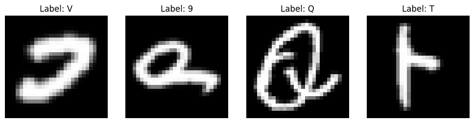
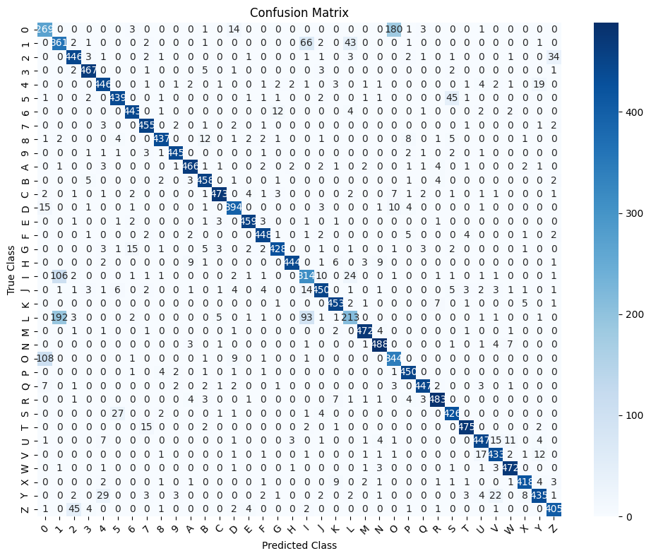

# Handwritten Digit and Character Recognition using EMNIST Dataset

A deep learning project implementing a Convolutional Neural Network (CNN) in **PyTorch** to perform real-time recognition of handwritten digits and uppercase characters, complete with an interactive web UI powered by **Gradio**.

---

## Tech Stack

* **Language**: Python 3.x
* **Deep Learning Framework**: PyTorch, Torchvision
* **Web UI Framework**: Gradio
* **Image Processing**: Pillow (PIL), NumPy
* **Environment & Tools**: Jupyter Notebook, Git

---

## Overview

The EMNIST (Extended MNIST) dataset is a set of handwritten character digits derived from the NIST Special Database 19. While traditional MNIST only contains digits (`0–9`), EMNIST provides a comprehensive collection of both numbers and letters.

This project focuses on a **36-class classification problem**:
* **Digits**: `0` through `9` (10 classes)
* **Uppercase Letters**: `A` through `Z` (26 classes)

---

## Key Technical Features & Challenges

### 1. EMNIST Orientation & Alignment Handling
PyTorch's raw binary representation of EMNIST images stores pixel matrices transposed relative to standard human drawing orientation. Passing raw canvas inputs directly into a trained CNN often causes misclassifications.

To bridge this gap during real-time inference, the model input pipeline applies:
* **Alpha Channel Compositing**: Merges transparent sketches from `gr.Sketchpad` onto a solid white background.
* **Color Inversion**: Inverts drawing strokes from black-on-white to standard white-on-black background expected by CNN models.
* **Axis Transformation**: Applies `ROTATE_270` followed by `FLIP_LEFT_RIGHT` via PIL to guarantee input tensors align with PyTorch's internal dataset geometry.

### 2. Dynamically Mapped Output Classes
Model predictions are mapped using an explicit dictionary mapping scheme:

`labels_map = {0...9 -> '0'...'9', 10...35 -> 'A'...'Z'}`

---

## Model Architecture

The neural network utilizes a Convolutional Neural Network (CNN) optimized for 28×28 grayscale images:

```text
Input (1 x 28 x 28)
  │
  ├── Conv2d(1, 32, kernel_size=3, padding=1) + BatchNorm2d + ReLU
  ├── MaxPool2d(2, 2)
  ├── Conv2d(32, 64, kernel_size=3, padding=1) + BatchNorm2d + ReLU
  ├── MaxPool2d(2, 2)
  ├── Flatten
  ├── Linear(64 * 7 * 7, 128) + Dropout(0.5) + ReLU
  └── Linear(128, 36)
## Evaluation & Metrics

The model demonstrates strong evaluation performance on unseen test sets across digits and uppercase letters:

```text
Accuracy: 0.8914

Overall Metrics Summary:
              precision    recall  f1-score   support
    accuracy                           0.89     17280
   macro avg       0.89      0.89      0.89     17280
weighted avg       0.89      0.89      0.89     17280

```

### Visualizations

| EMNIST Samples | Model Confusion Matrix |
| :---: | :---: |
|  |  |
---

## Setup & Execution

1. **Clone the repository**:
```bash
git clone [https://github.com/supriya20242007/emnist-character-recognition.git](https://github.com/supriya20242007/emnist-character-recognition.git)
cd emnist-character-recognition

```


2. **Install dependencies**:
```bash
pip install torch torchvision gradio pillow numpy jupyter

```


3. **Run the Notebook**:
Open `Notebook- EMNIST.ipynb` in VS Code or run:
```bash
jupyter notebook "Notebook- EMNIST.ipynb"

```


Execute the notebook cells sequentially to train the model, evaluate performance metrics, and launch the embedded Gradio web app directly inside the notebook.

```

```
